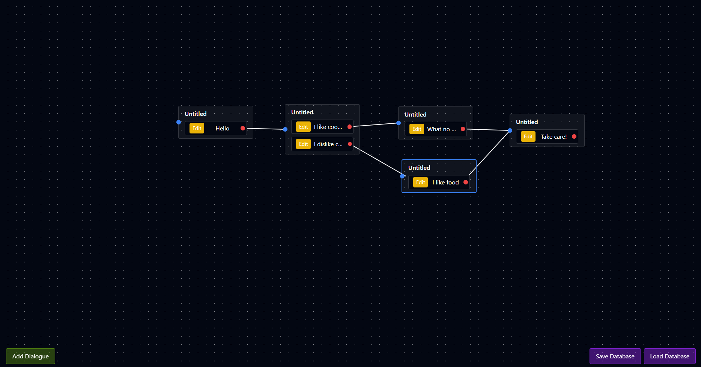

# Payung Event Editor

<i>Current state</i>

---

A simple node editor module for payung event datatype. To be integrated with Payung engine later on for Visual Novel and RPGM type game.

## Branches

*   `main`: **Payung Releases** - Stable releases.
*   `dev`: **Kaede Releases** - Latest bug fixes and experimental features.

## Known Issues

**Current Bugs and Glitches:**

*   [ ] SFX must be re-added each time a detail sprite is edited.
*   [ ] SFX is not yet implemented in the scene preview.
*   [ ] Actor/Speaker color is not saved.

## Current Milestones (Kaede)

**To Do:**

*   [ ] Implement Mouse Area Selection for Nodes
*   [ ] Delete nodes with keyboard (Delete key)
*   [ ] Middle-click to pan the editor view
*   [ ] Context menu for copy/paste and bulk delete operations
*   [ ] Audio SFX and music per scene
*   [ ] Music transitions
*   [ ] Sprite preset positions
*   [ ] Custom main menu and GUI editor
*   [ ] Font upload functionality
*   [ ] Modal editor improvements
*   [ ] Script node (similar to Godot, attach scripts to nodes for dialog and event logic)
*   [ ] Video support

## Payung Releases - Feature Changelog

**Release: 2025-02-21**

**New Features:**

*   [x] Conditional choices
*   [x] Flag requirement choices
*   [x] Load events from SQLite database
*   [x] Save events to SQLite database
*   [x] SFX for sprites
*   [x] Music player for events
*   [x] Scene editor integration (upcoming)
*   [x] Zoom In/Out for workspace navigation
*   [x] Panning functionality
*   [x] Move events independently of choices
*   [x] Color-coded actors/speakers
*   [x] Scene title setting
*   [x] Script Parser
*   [x] Scene Preview
*   [x] Change sprite source without resetting position